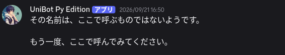
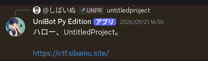
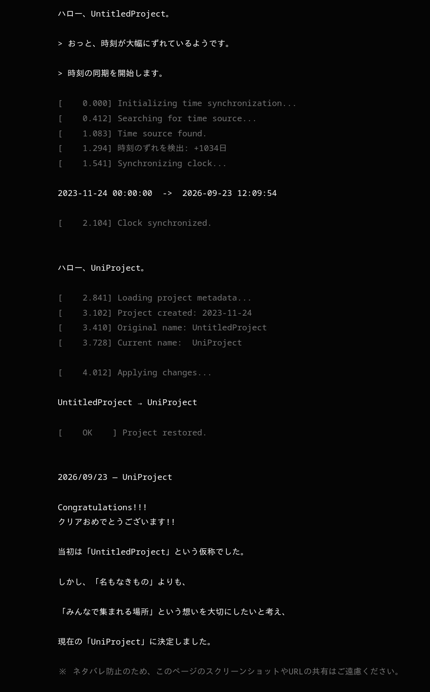

# まだ何もない場所writeup

2026/9/21、「2023/11/24 — まだ何もない場所」を公開しました。  
今回は、今後定期的に実施する予定のCTF※1に向けた難易度調整と、私自身の運営スキル向上を目的とした試験的な開催です。

問題文

```
### 2023/11/24 — まだ何もない場所

ハロー、UniProject。
……
どうやら、まだ少し早かったようです。


この場所で、正しい名前をもう一度呼んでみてください。
```

解説
タイトルにある通り、日付が2023/11/24となっています。
これは、UniProjectが発足されようとしている日時です。

それに加え

```
ハロー、UniProject。
……
どうやら、まだ少し早かったようです。
```

という部分よりこのときはまだ`UniProject`という名称になっていなかったのではと推測できるはずです。以上のことから、この問題の趣旨は`UniProject`となる前の名称を見つけるという解釈ができます。

この問題の目玉となる真っ白な画像を見ていきましょう。
今回のヒントはすべてここに隠されていました。
kritaなどの画像編集ソフトから「レベル補正」機能などを使うことにより白い画像から`UntitledProject`という文字が浮かび上がってくるのがわかります。
背景色ののRGBが(255,255,255)で文字色が(254,254,254)となっており、画像編集ソフトのレベル補正で白側の入力値をかなり下げると文字が浮かび上がります。  


答えは問題文に`この場所で、正しい名前をもう一度呼んでみてください。`とある通り、同じスレッド内で`UntitledProject`と投稿すると、投稿したメッセージが削除されBOTからDMで以下のように言われます。  
  
指示通りに再度DMで`UntitledProject`と投稿すると  
  
このようにURLが返ってきます。
このURLを踏むことで  
  
ここまで辿り着けば問題クリアです。

### 作成者のあとがき

みなさんこんにちは、今回の問題を作成したSibainuです。
私自身初のCTF問題作成でしたが、お楽しみいただけたでしょうか。
今回は初心者大歓迎ということで、難易度は低く作成しています。

今回の問題のストーリーはUniProjectの誕生時の何もない状態を問題とし、最後のクリア画面で現在時刻に時刻同期をする演出を挟んだあとに「ハロー、UniProject」と現在の名前になっていることがわかるストーリーとしました。

みなさんが、一番苦戦したであろう正解を言っているのにBOTが反応しない問題ですが、最初は「UntitledProject」(大文字小文字どちらでも可)でしか反応しない設定としていました。
これは、皆さんが解いている中でUntitledProjectに限定しなくても良いと思い途中から条件を「UntitledProjectを含む」に変更しています。

さて、冒頭で`今後定期的な実施`と言いましたが、スパンは多少変動すると思いますが、今後はより簡単な問題から難しい問題まで幅広い問題を作成しようと考えています。
私のCTFは、問題に飽きないように、ストーリー仕立ての問題を今後も作成していこうと考えています。ぜひ、次回もご参加お願いします。

問題の感想もつぶやく程度でいいのでお待ちしています。
次回の問題の作成に活かしていきます。

※1：CTFはCapture The Flagの略で情報セキュリティに関する専門知識や技術を駆使して、隠された「Flag（フラグ＝答えとなる文字列）」を見つけ出し、得点を競い合う競技です。
